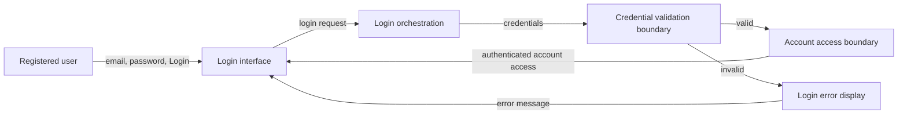

# Architecture

## 1. Overview

This architecture supports the approved login requirements for US-001. It
covers the minimum logical flow for a registered user to enter an email and
password, initiate Login, and receive one of two outcomes:

- Valid credentials: the user is logged in and receives access to the user's
  account (FR-001, FR-002, FR-003).
- Invalid credentials: the user is shown an error message (FR-004).

The architecture is intentionally implementation-neutral. The authentication
provider, persistence model, session mechanism, account landing destination,
validation rules, and non-functional requirements are `Not Found` in the
approved requirements.

## 2. Architecture Diagram

The diagram shows logical boundaries only. The concrete protocols, deployment
topology, provider, and account-access implementation are `Not Found`.

## 3. Components

| Component | Type | Requirement traceability |
| --- | --- | --- |
| Login interface | User-facing component for entering credentials and selecting Login | FR-001, FR-002 |
| Login orchestration | Coordinates a login request and routes the authentication result | FR-002, FR-003, FR-004 |
| Credential validation boundary | Validates supplied credentials through an authentication mechanism | FR-003, FR-004 |
| Account access boundary | Represents access granted after successful authentication | FR-003 |
| Login error display | Presents an error when credentials are invalid | FR-004 |

No additional application components are required by the approved scope.

## 4. Component Responsibilities

### Login interface

- Provide controls for an email address and password (FR-001).
- Provide a Login action (FR-002).
- Submit the entered credentials to Login orchestration.
- Present successful account access or the returned login error.

Field validation rules, password masking, and client-side validation behavior
are `Not Found` and require approval before implementation.

### Login orchestration

- Accept a login request from the Login interface.
- Pass the supplied credentials to the Credential validation boundary.
- On a valid result, establish or consume whatever authenticated state is
  approved and route the user to account access (FR-003).
- On an invalid result, return an error outcome to the Login interface (FR-004).

The API style, endpoint, payload schema, retry policy, and concrete session
creation behavior are `Not Found`.

### Credential validation boundary

- Determine whether the submitted credentials are valid or invalid.
- Keep the provider-specific implementation behind a boundary so the login
  flow does not depend on an unapproved provider choice.

The authentication provider, credential store, account-state rules, and
provider protocol are `Not Found`.

### Account access boundary

- Represent the successful outcome in which the user can access the account.
- Enforce the approved authenticated state when account functionality exists.

The account destination, account capabilities, and authorization model are
`Not Found`.

### Login error display

- Display an error after the Credential validation boundary reports invalid
  credentials (FR-004).

The exact text, presentation, localization, and account-enumeration behavior
are `Not Found`.

## 5. Technology Choices

The requirements do not specify a technology stack. The following choices are
therefore `Not Found` and require approval before implementation:

| Concern | Choice |
| --- | --- |
| Client or UI framework | `Not Found` |
| Server or application runtime | `Not Found` |
| Communication protocol and API style | `Not Found` |
| Authentication provider | `Not Found` |
| Credential persistence | `Not Found` |
| Session or token mechanism | `Not Found` |
| Account data persistence | `Not Found` |
| Hosting and deployment | `Not Found` |
| Logging and monitoring | `Not Found` |

Proposed architectural constraint requiring human approval: select mature,
maintained platform capabilities for credential verification and session
protection rather than implementing cryptography or password storage in the
application. The specific provider and platform remain undecided.

## 6. Data Flow

1. The registered user enters an email address and password in the Login
   interface (FR-001).
2. The user selects Login, and the interface sends a login request to Login
   orchestration (FR-002).
3. Login orchestration sends the supplied credentials to the Credential
   validation boundary.
4. The validation boundary returns either a valid or invalid result.
5. For a valid result, Login orchestration provides the approved authenticated
   state to the Account access boundary, and the user receives account access
   (FR-003).
6. For an invalid result, Login orchestration sends an error outcome to the
   Login error display, which shows the user an error message (FR-004).

The following data-flow details are `Not Found`: whether credentials are sent
to a local service or external provider, request and response schemas,
encryption in transit, session contents, session duration, persistence writes,
and account destination.

## 7. Security

The approved requirements do not define security controls beyond the need to
distinguish valid and invalid credentials. The following are therefore
`Not Found` and require approval:

- Transport security requirements.
- Password masking and credential handling rules.
- Password hashing, credential storage, and secret management.
- Session cookie or token properties, expiration, renewal, and revocation.
- Logout behavior.
- Rate limiting, lockout, bot protection, and repeated-login handling.
- Multi-factor authentication.
- Account-state and authorization checks.
- Audit logging, monitoring, and alerting.
- Error wording rules that prevent account enumeration.

Proposed security decision requiring human approval: credentials should be
handled by an approved authentication provider or security-reviewed service,
and the application should avoid logging raw credentials. This is a proposed
control, not an approved requirement.

## 8. Architecture Decisions

| Decision | Status | Rationale and traceability |
| --- | --- | --- |
| Use a small logical login flow with separate UI, orchestration, validation, and account-access boundaries | Proposed | Covers FR-001 through FR-004 without inventing product behavior |
| Keep authentication-provider integration behind a boundary | Proposed; approval required | The provider and interface are `Not Found`; preserves the approved scope while allowing a later choice |
| Treat valid and invalid credential results as the only defined outcomes | Approved by requirements | Directly represents FR-003 and FR-004; other outcomes are unspecified |
| Do not define persistence or session technology in this architecture | Required by current evidence | Requirements explicitly mark persistence and session details `Not Found` |
| Do not define a post-login destination or account capabilities | Required by current evidence | Requirements state these details are `Not Found` |

Human approval is required for the proposed technology, authentication,
credential-protection, session, persistence, validation, error, and account
access decisions before implementation planning treats them as fixed.

## 9. Risks

| Risk | Impact | Mitigation or decision needed |
| --- | --- | --- |
| Authentication provider and credential storage are undefined | Implementation cannot safely select an integration or persistence model | Approve provider ownership, protocol, and credential-protection approach |
| Session and logout behavior are undefined | Successful login may not produce a consistent or revocable authenticated state | Approve session model, duration, renewal, and logout behavior |
| Validation and error behavior are undefined | Users may receive inconsistent feedback or account-enumerating errors | Approve validation rules and error-message policy |
| Account states and provider failures are undefined | Disabled accounts, missing accounts, and service outages have no defined outcome | Clarify supported account states and failure handling |
| Security and non-functional requirements are largely unspecified | The design may fail required security, accessibility, performance, or availability expectations | Define NFR-001 and associated security controls before implementation |

No implementation, external integration, persistence, session behavior, or test
evidence is asserted by this architecture document.